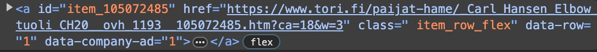
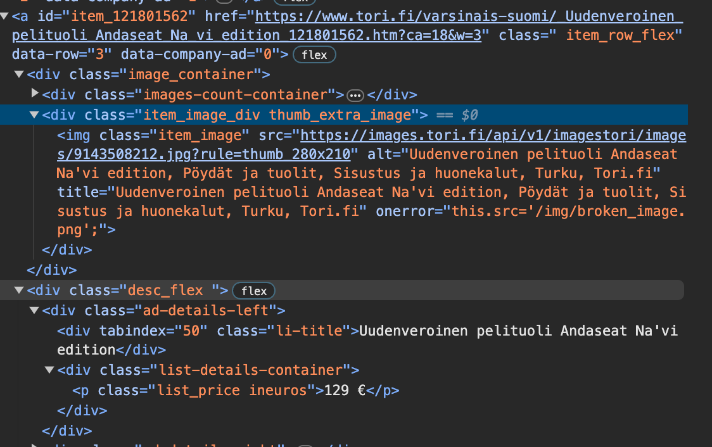
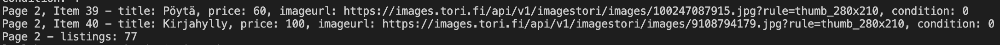

# Web scrapin Pythonilla
*Seminaarityöni aihe on web scraping pythonilla. Idea aiheeseen syntyi ohjelmistoprojekti2 kurssin aikana, missä scraping oli isossa roolissa datan keräämisessä. Projektissa oli tavoitteena toteuttaa scrapperit valituille sivuille, joista pystyttiin keräämään relevanttia dataa projektin tarpeisiin.*

*Toteutin projektiin scraperin hakemaan dataa tori.fi sivustolta. Python valikoitui ohjelmointikieleksi, sillä se todettiin monessa lähteessä parhaaksi vaihtoehdoksi.*

*Lopputuloksena oli toimiva scraper, joka hakee torista haluttujen tuotteiden nimen, kunnon, hinnan ja kuvan linkkinä. Tieto tallennetaan jsonina ja pusketaan mongoDB kantaan.* 

## Tori scraper 
*Tarve saada Torista dataa syntyi Sampo arvolaskuri projektissa. Sampo arvolaskuri on sovellus, jonka avulla käyttäjä voi selvittää jälleenmyynti arvon käytetylle tuotteelle esim. huonekalulle. Arvolaskurin arvio perustuu jo myynnissä olevien vastaavien tuotteiden hintoihin.*

`https://github.com/ohjelmistoprojekti-sampo/sampo.git`

*Tori oli otollinen kohde scraperille, sillä sivustolla on valtava määrä tavaraa myynnissä ja näin ollen dataa on saatavilla suuri määrä.* 

### Työvaiheet
* Aheen tutkiminen
* Koodaaminen ja debugging
* Viimeistely ja tietokantaan yhdistäminen

*Aiheen tutkiminen lähti liikkeelle puhtaasti googlaamalla ja Chat GPT:tä hyödyntämällä, sillä scraper konseptina oli vieras ja osaaminen Pythonista alkeiden tasolla. Python valikoitui kieleksi sen perusteella, että se todettiin useassa lähteessä parhaaksi scraperin toteuttamiseen mm. sen sisältämien kirjastojen vuoksi. Pythonin syntaksi on myös suhteellisen helppo sisäistää vaikka aikaisempaa kokemusta ei hirvästi ole*
## Huomioitavaa
*Web scrapingiin liittyen on hyvä ottaa huomioon joitain käytäntöjä. Sivun **robots.txt** ja **käyttöehdot** kannattaa käydä läpi sen varalta, että scraping on kielletty kyseisellä sivulla. Kerätty data ei saa olla tekijänoikeuslain suojassa tai sisältää henkilötietoja. Yksityistä tietoa ei myöskään tule levittää julkiseen tietoon. Sivustoa ei tule kuormittaa liikaa, jotta pääsyä sivustolle ei estetä. Pahimmillaan vääränlaisesta scrapingista voi koitua oikeudellisia toimia, mutta julkisen tiedon hakeminen omaan käyttöön esim. kouluprojektia varten tuskin aiheuttaa ongelmia.*

## Käytetyt kirjastot
*Selenium on avoimenlähdekoodin projekti, joka tarjoaa rajapinnan ohjelmistojen testaamiseen ja automatisointiin. Pythonissa Selenium-kirjasto tarjoaa työkaluja sivujen automaattiseen ohjaamiseen, mikä on scraperille otollinen toiminnallisuus. Torin kohdalla Chrome web-driver avaa chromeen halutun osoitteen ja hakee halutun määrän haluttua dataa.*

`https://pypi.org/project/selenium/`

*BeautifulSoup on kirjasto, joka mahdollistaa tiedon eristämisen sivun html-rakenteesta. BeautifulSoupin find - metodin avulla tiedon haku on yksinkertaista, kunhan on perehtynyt sivun rakenteeseen ja tietää mistä haluttu data löytyy. BS:n find- metodi mahdollistaa haluttujen elementtien löytämisen html-rakenteesta.*    

`https://pypi.org/project/beautifulsoup4/`

*Requests on yksi ladatuimmista Pythonin kirjastoista. Se mahdollistaa http-pyynnöt Pythonilla.*  

`https://pypi.org/project/requests/`

## Toiminta

*Sivun html-rakenne on olennaisin osa srcaperin rakentamisessa. Torin kohdalla lähdin selvittämään mistä haluttu data saadaan. Jokaisella tuotteella on luokka **"item_row_flex"**, joten ensimmäisenä on haettava kaikki saman luokan omaavat tuotteet.*

 

 ```python
 try:
            WebDriverWait(driver, 10).until(EC.presence_of_element_located((By.CLASS_NAME, 'item_row_flex')))
        except TimeoutException:
            print(f"Timeout waiting for page {page_number} to load")
            continue  
        page = BS(driver.page_source, "html.parser")
        products = page.find_all('a', class_='item_row_flex')

        if not products:
            print(f"No items found on page {page_number}")
            continue  # Move on to the next page if there are no items
````
*Scraperin suhteen on oltava valmis reagoimaan muutoksiin sivun rakenteessa ja helppo muokattavuus onkin tavoiteltava lopputulos. Esimerkiksi luokan nimen muuttuminen tarkoittaa sitä, että muutos tulee tehdä myös koodiin.*

*Tutkimalla hieman syvemmälle sivun rakenteeseen. Torista haluttiin saada tuotteen nimi, hinta, kunto ja kuva. Jälleen tutkimalla html-rakennetta selvisi, että jokaisen item-row-flex luokan alta löytyy useampi div, joista saadaan luokkien nimillä eroteltua haluttu dataa.* 




```python
for i, products in enumerate(products, start=1):
            try:
                title = products.find('div', class_="li-title").contents[0]
                try:
                    price = products.find('p', class_="list_price ineuros").contents[0].replace(" ", "")
                except AttributeError:
                    price = None
                product_url = products.get('href')
```````
```python
image_container = products.find('div', class_='image_container')
                image_div = image_container.find('div', class_='item_image_div') if image_container else None
                img_url = image_div.find('img', class_='item_image')['src'] if image_div and image_div.find('img', class_='item_image') else 'N/A'
``````
*Torissa tutotteen kunnon saa selville vasta kun tuotteen klikkaa auki, joten kunnon slevittämiselle tarvittiin oma funktio*
```python
def cond(link):
    url = link

    page = requests.get(url)
    soup = BS(page.content, 'html.parser')

    cond_value = None

    # Find the "Kunto:" topic and its value in the table
    topic_elem = soup.find('td', class_='topic', string='Kunto:')
    if topic_elem:
        value_elem = topic_elem.find_next('td', class_='value')
        if value_elem:
            cond_value = value_elem.get_text().strip()

    return(cond_value)
``````
*Sivun URL oli myös ratkaiseva tekijä scraperin onnistumisessa. Ensimmäisissä versioisssa päänvaivaa aiheutti se miten dataa saa haettua usealta sivulta, kun yhdellä sivulla on vain noin 40 tuotetta. Ratkaisu löytyi kun tutkin miten osoite muuttuu sivujen välillä liikuttaessa. Lopputuloksena URL:n lopussa oleva sivunumero korvattiin muuttujalla, jota kasvatetaan niin kauan kunnes haluttu määrä sivuja on käyty läpi. Osoitteen avulla määritellään myös se mitä tuotteita haetaan ja halutaanko vain yksityishenkilöiden listaamia tuotteita vai myös yritysten.*

```python
def scrapeTori(num_pages=200):  # Set the number of pages you want to scrape
    # Set up Chrome driver
    driver = webdriver.Chrome()

    scraped_data = []

    for page_number in range(1, num_pages + 1):
        #change the url based on products wanted
        URL = f"https://www.tori.fi/koko_suomi/sisustus_ja_huonekalut?ca=18&q=sisustus%20ja%20huonekalut&cg=3020&st=s&w=3&o={page_number}"
        driver.get(URL)
        print(URL)
````
## Data tietokantaan

*Projektissa haluttu data pusketaan MongoDB tietokantaan, mistä se haetaan hinta-arvion muodostusta varten.* 

*Muutama seikka oli huomioitava siinä missä muodossa ja minkälaista dataa tietokantaan pusketaan. Torissa hinnat ovat muodossa "10€" eli merkkijonona kun taas projektin tietokantaan tulee puskea vain kokonaislukuja.* 
```python
#remove non digits from price and convert to int
cleaned_price = ''.join(p for p in price if p.isdigit())
price_int = int(cleaned_price)
````
*Samoin kunto täytyi muokata uuteen muotoon, sillä torissa kunto on ilmaistu muodossa "hyvä" jne. kun taas projektin tietokantaan haluttiin vain luvut asteikolla 1-5 (jos luvulla ei ole määritelty kuntoa saa se arvoksi 0).*
```python
# get numeric value for each condition
def translate_condition_to_number(condition):
    condition_mapping = {
        "Uusi": 5,
        "Erinomainen": 4,
        "Hyvä": 3,
        "Tyydyttävä": 2,
        "Huono": 1
    }
    return condition_mapping.get(condition, 0) 
````
*Lopulta oikeassa muodossa oleva data pistetään pakettiin jsonina ja palautetaan.*

```python
item_data = {
  "title": title,
  "price": price_int,
  "imageurl": img_url,
  "condition": condition_number
}
scraped_data.append(item_data)
````
*Driverin käynnissä olon aikana haettuja tuotteita sekä määrää per sivu voi seurata, myös virhetilanteet on huomioitu.*
```python
                #follow the process
                print(f"Page {page_number}, Item {i} - title: {item_data['title']}, price: {item_data['price']}, imageurl: {item_data['imageurl']}, condition: {item_data['condition']}")

            except Exception as e:
                print(f"Error processing item {i} on page {page_number}: {e}")
        #check amount of products scraped
        print(f'Page {page_number} - listings: {len(scraped_data)}')
    
    driver.quit()  # Close the browser when done
    return scraped_data 
````

*Varsinaiselle tietokantaan puskulle on oma scriptinsä, missä muodostetaan yhteys tietokantaan, filteröidään data img urlin perrusteella niin että mitään ei mene kantaan kahta kertaa ja lopulta pusketaan data tietokantaan.*


## Yhteenveto
*Scraperin teko oli lopulta kiinnostavaa ja laajemman ohjelman luonti Pythonilla toi onnistumisen tunteen. Python kokemusta oli vain Python kurssin viope tehtävistä, joista oli toki hyötyä, mutta ne olivat kuitenkin hyvin perus tason koodaamista. Scraperin koodikaan ei toki ole kovin monimutkainen ja uskon, että sen tulkinta on suhteellisen helppoa, jos vain tietää hieman miten käytetyt kirjastot toimivat. Sain kuitenkin lisää intoa koodaamiseen onnistumisen myötä ja koin oppineeni aiheesta mitä ei välttämättä olisi tullut vastaan ilman sampo arvolaskuri projektia. Sain myös käyttää uusia pythonin kirjastoja joita ei ollut aikaisemmin tullut vastaan ja mahdollisesti pystyn hyödyntämään oppimaani tulevaisuudessa. Pythonilla koodaaminen alkoi myös tämän projektin myötä kiinnostaa tulevan työuran kannalta.*  

*Jälkikäteen ajateltuna Scraperin valmistumiseen ei olisi ehkä pitänyt mennä niin kauan kuin siihen meni vaikka aihe oli uusi. Muut kurssit ja niiden aikataulupaineet vaikuttivat toki tähän hieman. Jostain syystä jäin jumiin hieman liian pitkäksi aikaa useamman sivun läpikäymiseen, mikä lopulta ratkesi nopeasti Seleniumin web driverilla kun siihen paneutui tarpeeksi.* 

*Koodiin olen lopulta tyytyväinen vaikka harjaantunemman koodarin silmään osuisi varmasti parannettavaa. Web driverilla sivun ajaminen ja läpikäyminen oli mielestäni hyvä oivallus ja koska beautifulsoup oli jo käytössä koin, että kahden kirjaston yhteistyö scraperin toiminnassa on ok ratkaisu. Saatuani kuitenkin ulkopuolelta vinkin siitä, että saman lopputuloksen voisi saavuttaa pelkällä beautifulsoupilla tai pelkällä seleniumilla tein testimielessä muutoksia koodiin ja lopulta pääsin samaan toiminta logiikkaan pelkällä bs:llä.*
```python
def ScrapeTori(num_pages=2):
    base_url = 'https://www.tori.fi/koko_suomi/sisustus_ja_huonekalut?ca=18&q=sisustus%20ja%20huonekalut&cg=3020&st=s&w=3&o={}'

    scraped_data = []

    for page_number in range(1, num_pages + 1):
        url = base_url.format(page_number)
        response = requests.get(url)

        if response.status_code != 200:
            print(f"Failed to retrieve page {page_number}, status code: {response.status_code}")
            continue

        page = BS(response.content, 'html.parser')
        products = page.find_all('a', class_='item_row_flex')

        if not products:
            print(f"No items found on page {page_number}")
            continue
 ````
 *Myös kuvan haussa piti tehdä muutoksia:*
 ```python
 image_container = product.find('div', class_='image_container')
                img_url = 'N/A'
                if image_container:
                    image_div = image_container.find('div', class_='item_image_div')
                    img_class = image_div.find('img', class_='item_image') if image_div else None
                    img_url = img_class['src'] if img_class and 'src' in img_class.attrs else 'N/A'
 ````
*Logiikka pysyy käytännössä samana, sivunumero formatoidaan sivun url:iin aina kun looppi lähtee pyörimään uudestaan. Kuvan haussa logiikka pysyy myös suht samana, käytännössä selvitetään sisältääkö tuotteen img tagi src:n eli kuvan linkin.* 

*Mielestäni tämä ratkaisu on lopulta parempi, sillä webdriver jää kokonaan pois, mikä tekee koodista vielä simppelimmän ja driveria ei tarvitse asentaa koodin ajamiseen. Tästä opin sen, että ensimmäinen toimiva ratkaisu ei välttämättä ole paras vaan joskus on hyvä tutkia voisiko saman tuloksen saada tehokkaammin.* 

*Tärkeimpinä oppeina tästä projektista jäivät laajemman ohjelman koodaaminen Pythonilla ja sen kirjastojen hyödyntäminen sekä web scraping ja sen käytännöt. Hyödynsin scaperin koodaamisessa myös chat GPT:tä ja opin minkälaisia kysymyksiä kannattaa esittää. Tärkeää on muodostaa oma ratkaisu ja ottaa tekoälyltä siihen mukaan esimerkkejä tai vaihtoehtoja.*
## Lähteet
`https://realpython.com/python-web-scraping-practical-introduction/`
`https://chat.openai.com/`
`https://realpython.com/beautiful-soup-web-scraper-python/`
`https://oxylabs.io/blog/python-web-scraping`
*Kirjastot osiossa mainitut linkit*

